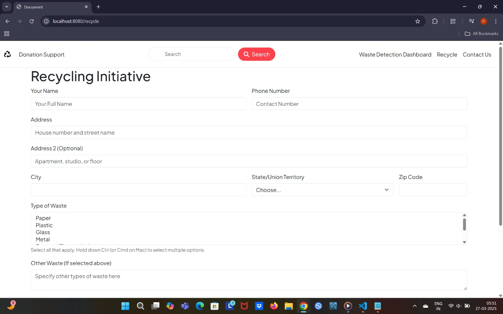
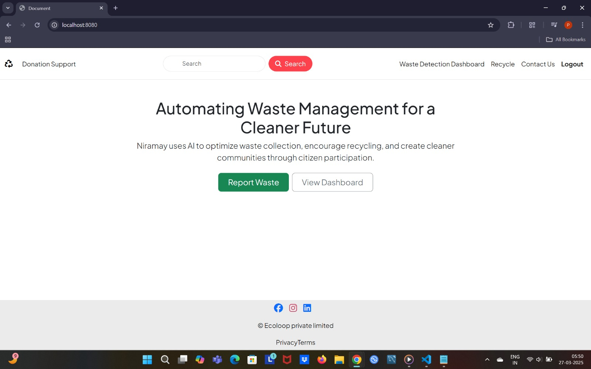
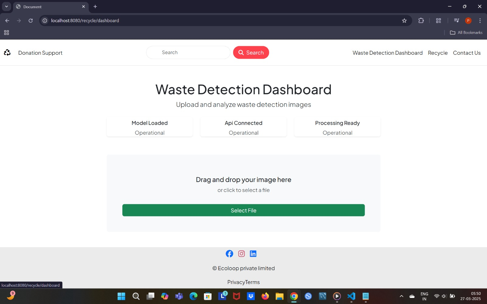
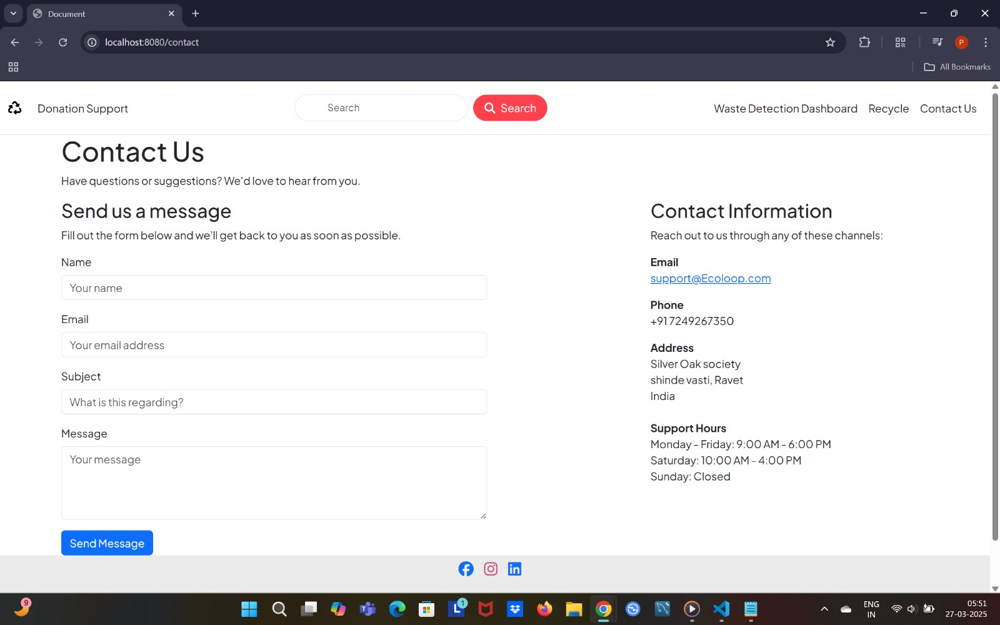

# EcoLoop

## Description
Develop an innovative waste management solution to reduce landfill waste, lower greenhouse gas emissions, and promote recycling. The system should integrate digital tracking for waste collection and recycling, enabling municipalities to monitor waste flow efficiently. Additionally, implement community-driven waste recycling methods, including torrefaction of municipal solid waste (MSW) into bioenergy pellets and landfill gas (LFG) collection for renewable energy generation. The goal is to create net-zero waste communities through sustainable and technology-driven solutions.

## Installation
1. Clone the repository.
2. Run `npm install` to install dependencies.
3. Start the application with `npm start`.

## Usage
Access the application at `http://localhost:3000`.

## License
This project is licensed under the ISC License.
