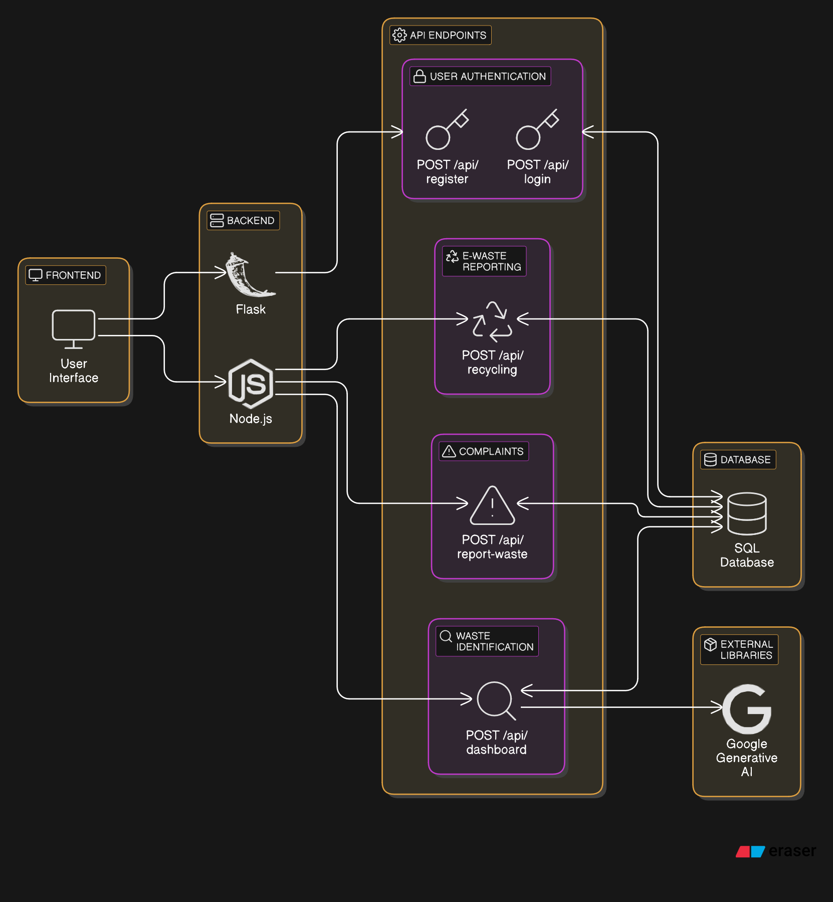

# Documentation for E-Waste Management Website
## Overview

The Personal **E-Waste Management Website** is designed to provide users with an efficient platform to report e-waste in their locality, raise complaints, upload images of e-waste, and access information on how to recycle various types of waste. The website is user-friendly and serves as a crucial tool in promoting sustainable waste management practices.

- Features

1. User Registration and Login: Users can create an account and log in to manage their reports and complaints.
2. Report E-Waste: Users can report e-waste occurrences by filling out a form with relevant details.
3. Complaint Management: Users can raise complaints regarding illegal dumping or improper waste management issues in their locality.
4. Image Upload: Users can upload images of the e-waste they are reporting for better identification and management.
5. Waste Identification and Recycling My workspace

Technology Stack

- Frontend: HTML, CSS, JavaScript
- Libraries Used: Flask, google.genrative-ai
- Backend: Node.js, Express.js
- Database: SqlAlchemy

## Architechture




Prerequisites

- Node.js
- MongoDB
- npm (Node Package Manager)
- AWS Account (if using S3 for image uploads)

Steps

- Clone the Repository
```bash
git clone https://github.com/yourusername/ewaste-management-website.git
```

- Navigate to the Project Directory

```bash
cd Ecoloop
```


### Run the Application

#### Start the Backend server:

```code
python app.py
```
-Open Your Browser Navigate to http://localhost:5000 to view the website.

- Run the frontend server
Navigate to the frontend directory and run the following.

 Install Dependencies
```bash
cd frontend
npm install
```

```bash
npm start
```

Open Your Browser Navigate to http://localhost:3000 to view the website.

API Endpoints
User Authentication

    POST /api/register: Register a new user.
    POST /api/login: Authenticate user and return a token.

E-Waste Reporting

    POST /api/recycling:
        Request Body: { "location": "string", "description": "string", "image": "file" }
        Response: Confirmation of report submission.

Complaints

    POST /api/report-waste:
        Request Body: { "issue": "string", "location": "string", "image": "file" }
        Response: Confirmation of complaint lodgement.

Waste Identification

    POST /api/dashboard:
        Request Body: { "image": "file" }
        Response: { "wasteType": "string", "recyclingInfo": "string" }

Frontend Functionality
Components

    LoginComponent: Handles user authentication.
    RegisterComponent: Allows users to create an account.
    ReportComponent: Layout for reporting e-waste including form fields and image upload.
    ComplaintsComponent: Interface for filing complaints regarding illegal waste management.
    Dashboard: Displays recycling information based on waste identification.

Styling

The website utilizes Embedded JavaScript for responsive design. Customize styles in style.css and make use of EJS classes for layout management.
Conclusion

The Personal E-Waste Management Website aims to serve as a comprehensive platform for users to engage with their community regarding e-waste issues. By enabling report submissions and providing information on recycling, the website contributes to local sustainability efforts.
Future Enhancements

- Integration of geolocation to track waste reports visually on a map.
- Enhancement of image classification algorithms for better waste type identification.
- Implementation of notification systems for users when their reported cases are addressed.


  